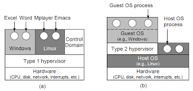

# Introduction To Virtualization

In this article, I hope to show you the basics of virtualization summarized in one place, in the recent time I searched for a new research topic and it came to my mind that I don't know very much about virtualization and about what goes on when I turn on my ubuntu VM in VMware Workstation.

First I’ll go through why we would want to use it, some history about the topic, the different types of virtualization and hypervisors, and a couple of techniques for efficient virtualization and to sum up, a little about memory virtualization.

## Why Should we use it

Let's say that we have a company that serves multiple services, and each of those services needs to run on a different operating system, it's not such an abnormal scenario.
For us to work properly we should have multiple physical computers and on each of them install the wanted operating system, and on them install our wanted programs. 

So we had to buy multiple computers, if we would have used virtualization we could have bought one computer and installed multiple operating systems on him, so we saved money and physical space.

Let's say that we have a service that needs X amount of GB of storage, after a month it now needs more storage space, should we go and get a new computer that fits the new description?  If we had used virtual machine technology we could have just powered off the VM, adjust the amount of storage appropriately and turn it back on :)

Say that we want to move our machine to a different place, say a different country, should we shut the computer down, and send it on an airplane? Or could we copy its VDI file and send it to a different place. sounds easier, right?.

## History

“In computing, virtualization refers to the act of creating a virtual version of something, including virtual computer hardware platforms, storage devices, and computer network resources” (Wikipedia).

Sounds cool but the idea has been here since the ’60s, if we look at the main idea, there is a special piece of software called VMM (virtual machine monitor) / hypervisor, its main job is to manage multiple copies of operating systems including the simulation of all of its different parts such as CPU, I/O devices and memory.

In 1974 two computer scientists, Gerald Popek and Robert Goldberg, published a seminal paper called “Formal Requirements for Virtualizable Third Generation Architectures” That provides the required information to between other things build a proper VMM by their prerequisites, in that context they defined three properties of interest.

* __Efficiency__ - all of the innocuous instructions are to be executed by the VMM, without any intervention at all from the VMM. (in contrast to Bochs which emulates all the underlying hardware and each instruction execution causes a number of procedures to update the inner data structures that represent the mentioned hardware) 
* __Resource Control__ - an arbitrary program running in the context of the VMM should not be able to affect the machine itself or other VM’s system resources, i.e, memory available to it, in this case, the allocator of the VMM should be invoked. (one VM should not be able to affect the TLB of the machine)
* __Equivalence__ - programs running inside a VM should be executing in a manner that is indistinguishable to a machine where the VMM is not resident, except for timing issues effected by resource availability problem, e.g, the allocator of the vmm could not currently satisfy the specific request for the VM, something that can happen often because the vmm itself takes some part of the VM address space.
	

Popek and Goldberg also suggested two groups of instructions, __sensitive__ and __privileged instructions__, the first kind of instructions is the kind that behaves differently in user and kernel mode, such as doing I/O or changing MMU settings. Privileged instructions are instructions that if occurred at user-mode, the CPU should trap.

In the paper they have also stated that in order for a machine to be virtualizable, the sensitive instructions should be a subset of the privileged instructions, therefore if an instruction that is not supposed to be operating in user mode, is called from user mode, it should trap.

At the time, the purpose of the work was to get the awareness that new architectures prevented the construction of a VMM. The theorem went lost for decades which caused new processor architectures to be designed without technical consideration (e.g X86).

## Types Of Hypervisors

If we will look at the types of hypervisors, we can distinguish between 2 types.
The first one is called Type 1 and the second Type 2 :)

|  |
|:--:|
| *Figure 7-1. Modern Operating Systems Fourth Edition, Page 478* |

Let us look at the first type, we can see that the hypervisor was installed directly on the hardware and above it was a number of operating systems. 
So in Type 1, the Hypervisor is also called “bare metal” because it is not installed directly on the hardware.
For example, Microsoft Hyper-V is a Type 1 Hypervisor.

If we will look at the second type of the hypervisor, we will see that it differentiates from the first type in several things, first of all, it is installed on top of an existing operating system, so no more bare metal and second is that there are other processes that run in the same level at the hypervisor.
The second thing is not completely true, let’s take for example VMware, which has a type 2 hypervisor, between other ones, VMware workstation, if you’ll run a VM instance you will see a process named VMX.

Which is the VMware process, but behind the scenes he’s cooperating with the VMM driver.
So VMware only appears to be a user-mode process, when in fact he installs a driver and communicates with it.

## Types of Virtualization

After we can distinguish between the two different types of hypervisors, It’ll be a good idea to be able to know the types of virtualization.

There are three types of virtualization: Full virtualization, Paravirtualization, and Hardware-Assisted Virtualization (HVM).

* __Full Virtualization__ -  Full virtualization provides the concept of virtualization as we know it but without changing the guest OS, it does it by using a technique called “binary translation” (explained below in “Techniques for virtualization”).

* __Para-virtualization__ -  In this technique, the guest OS kernel is modified to be able to run on top of a hypervisor and to be aware of its existence, of course, this change was meant to be able to run faster, but it comes with a price due to the fact that you cannot run arbitrary operating systems anymore because the OS you'll install will have to have paravirtualization-aware drivers, one such hypervisor, for example, is “Xen 1.0”

* __Hardware-Assisted__ Virtualization -  This type presented a new approach, if in paravirtualization you had to change the guest OS kernel, here you need to have special hardware,  for example, extra instructions to the ISA.
This technique is common nowadays in modern hypervisors, for instance, Hyper-V.

## Techniques for virtualization

We can distinguish between a couple of techniques for virtualization.
The difference will be in when and how we tell the hypervisor, because after all if there is an instruction that needs to be translated before running it will be translated.

__Trap and emulate__ - in this technique, every privileged instruction will be trapped to the hypervisor and he will emulate its behavior.

__Binary translation__ - the general idea is that there are architectures that do not answer to the ideology of Popek and Goldberg (e.g have some instructions that are sensitive but not privileged), so the goal is to find them statically or dynamically (i.e runtime) and replace them with instructions that have the desired effect.
In case of static binary translation, the hypervisor will examine the entire program or in the case of the dynamic binary translation he will operate on-demand, in this case, the hypervisor will translate in “basic blocks”, a basic block is a chunk of instructions that end with a branch instruction and does not contain any instruction that may change its flow of execution, after the translation the hypervisor will cache the translated basic block and run it, thus the time of translation will occur only once per unique basic block.
Having the cached block affects tremendously on the performance to the point that it can run at nearly full speed.

__Direct execution__ -   This simply means that you run “natively” (without binary translation, of course, there is still the translation to the hypervisor architecture) some parts of the code that do not contain any sensitive instructions, something you can know by scanning the basic blocks.

## Memory Virtualization

__GVA__ - guest virtual address
__GPA__ - guest physical address
__MVA__ - machine virtual address
__MPA__ - machine physical address

An arbitrary program inside VM A allocates virtual pages 5 and 6, The hypervisor then maps them to host physical pages 7 and 8, after that another VM wants to allocate pages, How can the hypervisor know which pages are to which VM?

We want to find a way to be able to map the guest virtual pages with the host physical pages without overwriting other VM’s pages, basically manage it like its a real computer.

The hypervisor should be able to keep track of the state that the guest OS thinks its at, in terms of memory.

A software-assisted solution is a __Shadow Page Tables__, its purpose is to map from GVA to MPA, so for each VM, the hypervisor will create a table of this kind. ??

The guest OS could change its mappings by just writing to memory, without any sensitive operations, so the hypervisor is not aware of the change and the shadow page table is not synced and then we lost its purpose.

So how could the hypervisor know if something has changed within the guest OS page tables?

A dummy solution in a full virtualized environment would be for the hypervisor to map the guest page tables as read-only, thus causing page fault in each access which will be trapped to the hypervisor to handle and update the shadow page table.

In a Paravirtualized environment, the guest could just let the hypervisor know after he finished changing the page table, after all, he is aware of its existence. 

Each fault or hypercall (the special calls in the para-virtualized environment) causes a “VM Exit” which is an instruction that makes the hypervisor to regain control, the hypervisor should save a lot of data (e.g VMCS data structure) and includes losing the address caching by flushing the TLB, in the end, we will need to revert the steps by calling a “VM Entry”, (i.e load the VMCS) it could be up to tens of thousands of cycles.

Nowadays these types of solutions (software-assisted)  are not recommended due to the number of hypervisor traps (e.g VM Exit and VM Entry) they have caused.

__Hardware-assisted paging (Intel’s Extended Page Tables)__ - In order to reduce the overhead caused by Software-assisted paging (i.e hypervisor traps) Intel’s strategy is __EPT__ which will improve performance.

An upside for using EPT over Shadow Page Tables is that in EPT the TLB gets an added responsibility and has the GVA to GPA and the MVA to MPA translation, the TLB has a new VM specific tag called Address Space IDentifier (ASID). With this tag, the TLB can now keep track of which TLB entry is to which VM which will result in that we don’t need to flush the TLB for each VM Exit, the TLB entries can coexist.

If the address was not found in the TLB, will go threw the EPT tables.

Tough VM Exit can still occur if the EPT cannot translate a GPA. Such an occasion should be infrequent.

